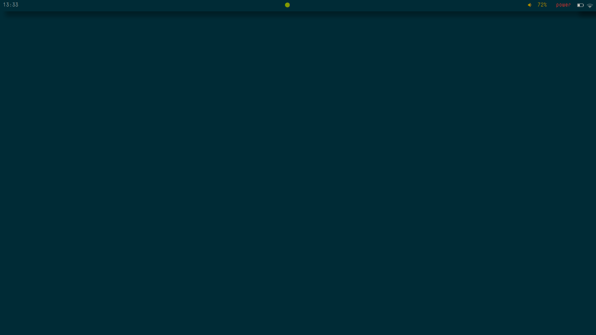
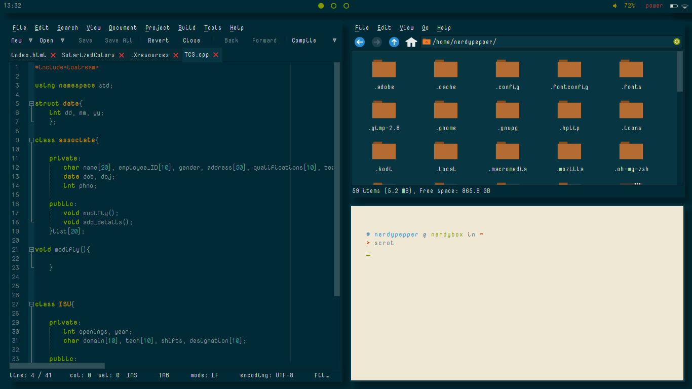
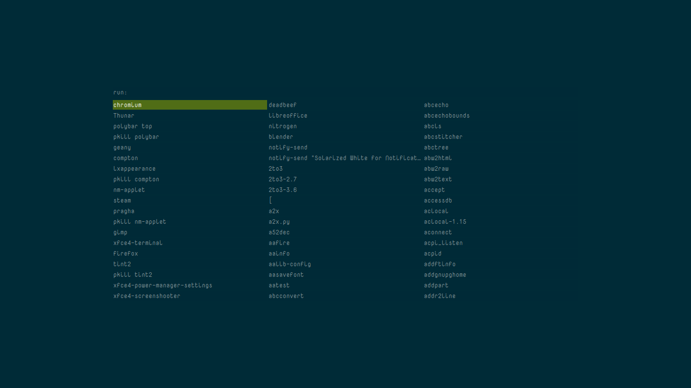
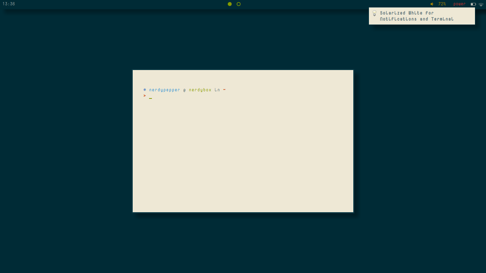
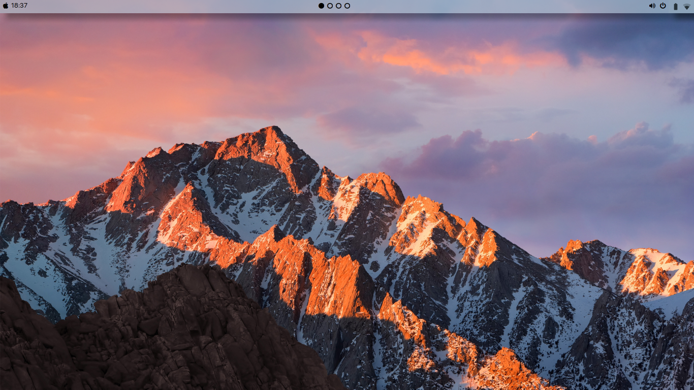
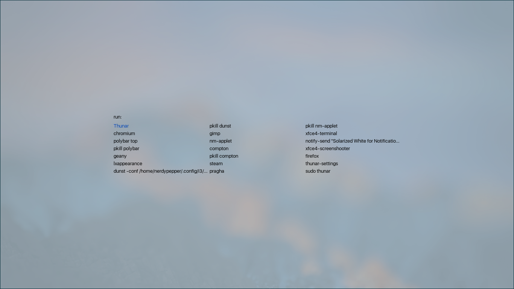
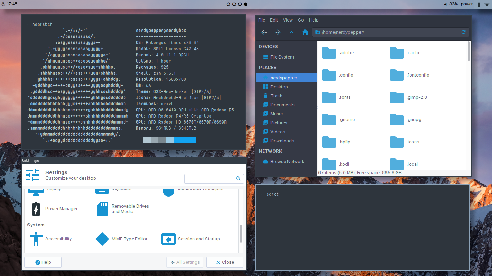
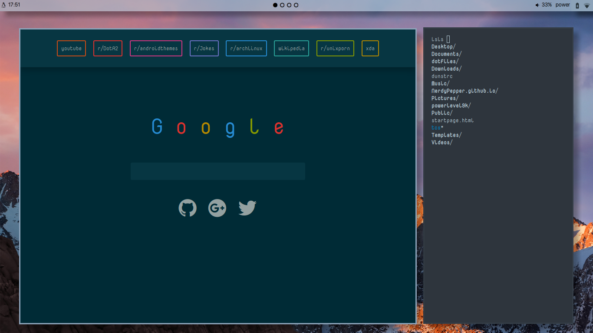

<<<<<<< HEAD
# dotfiles
<<<<<<< HEAD
All my dotfiles in one place

i3 screenshots:

  Clean:

  Fake Busy:

rofi screenshot:

URxvt and Dunst screenshots (.Xresources):

=======
=======
# AntergOS-X
>>>>>>> c25c0d76f4a13bf228737e381d2c6644130af603
My OS-X like configuration. Made with MacOS-Sierra in mind.

The startpage can be found [here](https://github.com/NerdyPepper/NerdyPepper.github.io). 

The GTK theme used is [OSx-Arc-Darker](https://github.com/LinxGem33/OSX-Arc-Darker) .

Fonts are the ones used in MacOS-Yosemite-[San Francisco](https://github.com/supermarin/YosemiteSanFranciscoFont)

# Screenshots

1.Clean

2.rofi: The blurred background must be set manually!

3.Fake Busy

4.Just another screenshot

>>>>>>> d1f93ffcd5f57fb0d050072669237167bb94a32f
