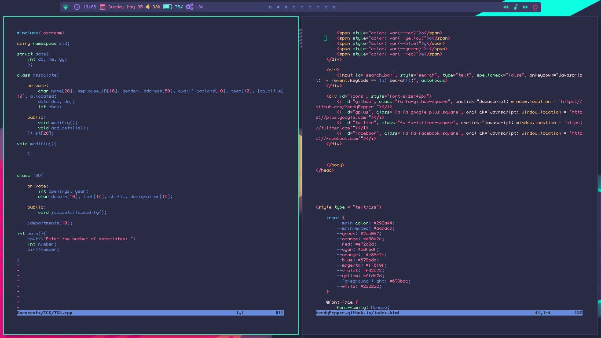

# Gloom

My latest rice (as of 24/4/17).

Based off the syntax coloring theme for Atom - [Gloom](https://atom.io/themes/gloom).

Modified a bit by me, to go with the Pokemon - [Gloom](http://bulbapedia.bulbagarden.net/wiki/Gloom_(Pok%C3%A9mon)).

Link to my Gloom startpage: [https://nerdypepper.github.io/](https://nerdypepper.github.io/)

# Screenshots

1.Clean

2.rofi

3.Text editing

4.dunst and urxvt

5.Cava and Wallpaper

6.Startpage

