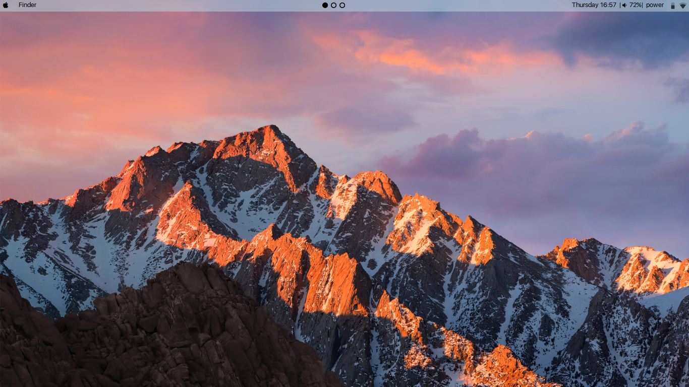

# AntergOS-X

My OS-X like configuration. Made with MacOS-Sierra in mind.

The startpage can be found [here](https://github.com/NerdyPepper/NerdyPepper.github.io). 

The GTK theme used is [OSx-Arc-Darker](https://github.com/LinxGem33/OSX-Arc-Darker) .

Fonts are the ones used in MacOS-Yosemite-[San Francisco](https://github.com/supermarin/YosemiteSanFranciscoFont)

# Screenshots

1.Clean

2.rofi: The blurred background must be set manually!

3.Fake Busy

4.Just another screenshot

5.i3-lock

